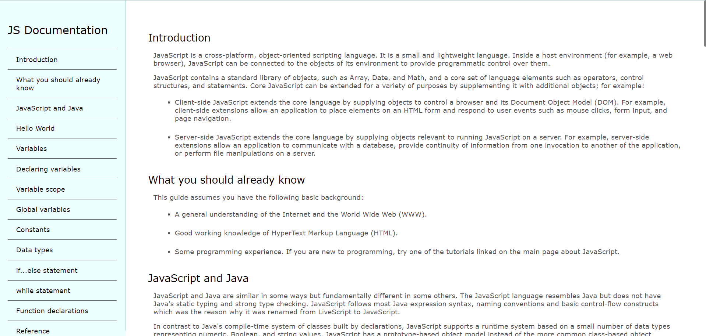
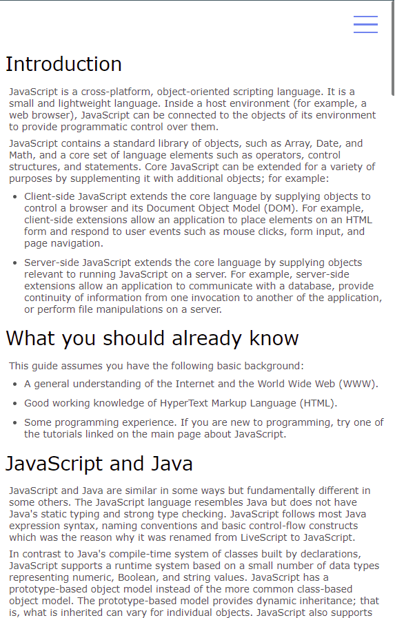
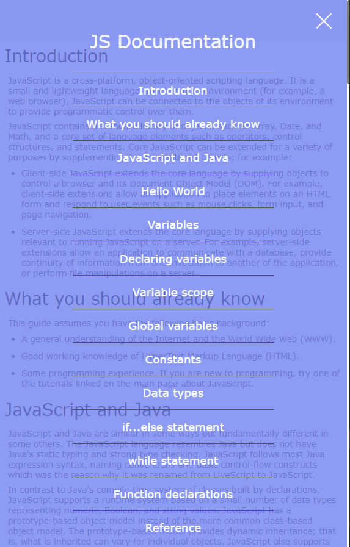

<!-- Please update value in the {}  -->

<h1 align="center">Product Landing Page</h1>

   Solution for the <a href="https://www.freecodecamp.org/learn/responsive-web-design/responsive-web-design-projects/build-a-technical-documentation-page" target="_blank">Product Landing Page</a>.

  <h3>
    <a href="https://miguelprzc.github.io/technical-documentation-page/">
      Demo
    </a>
     | 
    <a href="https://github.com/miguelprzc/technical-documentation-page/blob/main/index.html">
      HTML CODE
    </a>
     | 
    <a href="https://github.com/miguelprzc/technical-documentation-page/blob/main/styles.css">
      CSS CODE
    </a>
  </h3>

<!-- TABLE OF CONTENTS -->

## Table of Contents

- [Overview](#overview)
  - [Built With](#built-with)
- [Features](#features)
- [Contact](#contact)

<!-- OVERVIEW -->

## Overview

<h3>Desktop View</h3>

<h3>Mobile View</h3>

### Built With

<!-- This section should list any major frameworks that you built your project using. Here are a few examples.-->

- [HTML](https://html.spec.whatwg.org/multipage/)
- [CSS](https://www.w3.org/Style/CSS/)

## Features

<!-- List the features of your application or follow the template. Don't share the figma file here :) -->

This site was created as a submission to a [Product Landing Page Project](https://www.freecodecamp.org/learn/responsive-web-design/responsive-web-design-projects/build-a-technical-documentation-pagee) challenge. The task was to take a flat design and translate it into code.

## Contact

- GitHub [@miguelprzc](https://github.com/miguelprzc)
